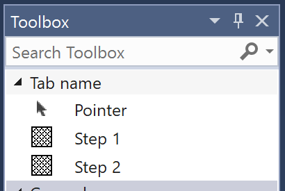
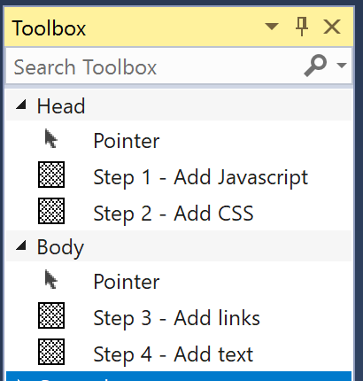

# Demo Snippets - Formatting

The DemoSnippets VS Extension works with files that use the ".demosnippets" extension or "sub-extension".

## *.demosnippets files

These files are the simplest and default way of automatically adding snippets to the Toolbox.

### Formatting

Files use a simple line based format.

- Comment lines start with a hash (#).
- Labels (displayed in the toolbox) start with a hyphen (-).
- Text between labels is included as the contents of the snippet.
- Snippets are added to the "Demo" tab. This can be overridden by specifying a tab name in a line starting "Tab:".

### Example

A .demosnippets file might look like this

```
# Comment

TAB: Tab name

- Step 1

// snippet 1 line 1
// snippet 1 line 2


- Step 2

snippet 2 line 1
snippet 2 line 2

```

The above produces this in the Toolbox



## *.demosnippets.{ext} files (sub-extensions)

Any file can contain DemoSnippets by defining tab and label names in embedded comments. This allows Visual Studio to provide syntax highlighting for the code you want to include in snippets.

The VSIX extension will look for demo snippets to add to the Toolbox in files that include the ".demosnippets" sub-extension. A "sub-extension" is an additional extension before the file extension. For example, `Program.demosnippets.cs` and `index.demosnippets.html` are C# and HTML file names with the appropriate sub-extension. Visual studio will continue to treat them like any other .cs or .html files but the DemoSnippets extension will know to look at them also.

### Formatting

With files using a ".demosnippets" sub-extension, formatting is indicated in comments. The works with any style of comment that the language/file type may use.

There are three indicators that can be used in code comments.

- `DEMOSNIPPETS-TAB` - This is used to specify the name of the tab in which to put subsequently indicated snippets. The name of the tab is specified after the indicator. If left blank the last defined tab will continue to be used. If no tab is specified, snippets will be placed in a tab named "Demo".

- `DEMOSNIPPETS-LABEL` - This is unsed to indicate the name of the tab and that subsequent lines should be included in a snippet. The desired name should appear immediately after the indicator. If no name is specified, the first line of the snippet will be used as the name. All lines after the label specifier will be included until either a new tab definition, a new label definition, or an "ENDSNIPPET" indicator is reached.

- `DEMOSNIPPETS-ENDSNIPPET` - This is used to indicate the the end of the snippet has been reached and any following lines should not be included. This is useful when you have lines in the file that you do not want included in any snippet.

Any tab or label name will not include a closing comment indicator.

All other comments or code in the file are ignored.

### Example

Here is an example of a HTML file with embedded DemSnippets comments.

```html
<!DOCTYPE html>
<html lang="en" xmlns="http://www.w3.org/1999/xhtml">
<head>
    <meta charset="utf-8" />
    <title>Demo stuff</title>
    <!-- DEMOSNIPPETS-TAB Head -->
    <!-- DEMOSNIPPETS-LABEL Step 1 - Add Javascript -->
    <script src="./scripts/coolstuff.js"></script>
    <script language="javascript" src="./scripts/Logging.js"></script>
    <!-- DEMOSNIPPETS-LABEL Step 2 - Add CSS -->
    <link href="./assets/standard.css" />
    <!-- DEMOSNIPPETS-ENDSNIPPET -->
</head>
<body>
<h1>Conference Demos</h1>
<!-- DEMOSNIPPETS-TAB Body -->
<!-- DEMOSNIPPETS-LABEL Step 3 - Add links -->
<ul>
    <li>Home</li>
    <li>Store</li>
    <li>About</li>
    <li>Admin</li>
</ul>
<!-- DEMOSNIPPETS-LABEL Step 4 - Add text -->
<p>Some important text to have on the page.</p>
<!-- DEMOSNIPPETS-ENDSNIPPET -->
</body>
</html>
```

The above produces this in the Toolbox



