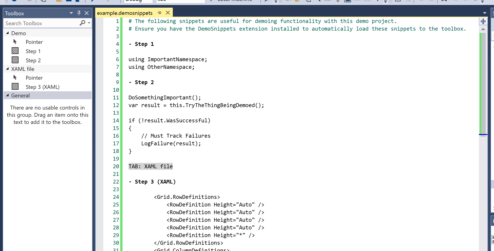

# Demo Snippets

Download this extension from the [VS Gallery](https://marketplace.visualstudio.com/items?itemName=MattLaceyLtd.DemoSnippets)
or get the [CI build](http://vsixgallery.com/extension/DemoSnippets.e2d68c23-8599-40e8-b402-a57060bf3d29/).

Supports Visual Studio 2017 & 2019

---------------------------------------

Visual Studio extension that provides functionality relating to *.demosnippets files and interacting with the Toolbox.
Intended to make it easy to use code snippets in demos.

## Features

- Store your code snippets in a file with a **.demosnippets** extension.
- Automatically add the contents of all .demosnippets files to the Toolbox when a solution loads. (Can be disabled in Options.)
- Automatically remove all demo snippets from the Toolbox when a solution is closed. (Can be disabled in Options.)
- Add individual files to the Toolbox by right-clicking on the file in Solution Explorer and selecting **'Add to Toolbox'**.
- Add all files to the Toolbox by right-clicking on the solution in Solution Explorer and selecting **'Add All DemoSnippets to Toolbox'**.
- Remove all DemoSnippets from the Toolbox by right-clicking on the Toolbox and selecting **'Remove All DemoSnippets'**.
- Remove any empty tabs from the Toolbox by right-clicking on the Toolbox and selecting **'Remove Empty Tabs'**.
- Automatically reload Toolbox entries when .demosnippets files are saved. (Can be disabled in Options.)

### .demosnippets file

- Comment lines start with a hash.
- Labels (displayed in the toolbox) start with a hyphen.
- Text between labels is included as the contents of the snippet.
- Snippets are added to the "Demo" tab. This can be overridden by specifying a tab name in a line starting "Tab:".

See the [change log](CHANGELOG.md) for changes and road map.

## Contribute
Check out the [contribution guidelines](CONTRIBUTING.md)
if you want to contribute to this project.

For cloning and building this project yourself, make sure
to install the
[Extensibility Tools 2015](https://visualstudiogallery.msdn.microsoft.com/ab39a092-1343-46e2-b0f1-6a3f91155aa6)
extension for Visual Studio which enables some features
used by this project.
